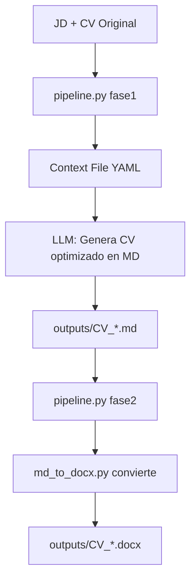

# Estructura de Scripts - Easy Job Apply AI v2.1

## 📂 Scripts Principales

El sistema ahora cuenta con **4 scripts esenciales y genéricos**:

```
scripts/
├── config.py           # Configuración centralizada
├── md_to_docx.py       # Conversor genérico MD → DOCX
├── pipeline.py         # Pipeline automatizado (Fase 1 y 2)
└── validate_yaml.py    # Validador de context files
```

## 🔧 Descripción de Scripts

### 1. `config.py`
**Propósito**: Configuración centralizada del sistema

**Contenido**:
- Rutas de directorios (sessions, outputs, templates)
- Información del candidato (nombre, contacto)
- Parámetros de formato CV (márgenes, fuentes, tamaños)
- Configuración ATS-friendly

**Ventajas**:
- ✅ Un solo lugar para todas las configuraciones
- ✅ Fácil actualización sin tocar código
- ✅ Consistencia en todos los scripts

### 2. `md_to_docx.py`
**Propósito**: Conversor genérico de Markdown a DOCX

**Características**:
- ✅ **Genérico**: Funciona con cualquier CV en Markdown
- ✅ **Reutilizable**: Un script para todos los JDs
- ✅ **Inteligente**: Detecta estructura automáticamente
- ✅ **Formato ATS**: Genera DOCX optimizado para ATS

**Uso**:
```bash
# Uso básico
python scripts/md_to_docx.py outputs/CV_Gonzales_Company_Position.md

# Con nombre personalizado
python scripts/md_to_docx.py outputs/CV_input.md -o CV_Custom.docx
```

**Estructura detectada**:
- Headers de sección (`##`)
- Subsecciones (`###`)
- Texto en negrita (`**texto**`)
- Bullets (`-`, `•`)
- Logros (`✓`)

### 3. `pipeline.py`
**Propósito**: Pipeline completo automatizado (Fase 1 y 2)

**Comandos**:

#### Fase 1: Análisis estratégico
```bash
python scripts/pipeline.py fase1 \
  --jd jds_input/Company_Position.txt \
  --cv resumes_txt/CV_Julio_Gonzales-SPA.txt \
  --salary "USD 4000-5500" \
  --company "Company Name" \
  --position "Position Title"
```

#### Fase 2: Generación DOCX
```bash
# Busca automáticamente el MD y genera DOCX
python scripts/pipeline.py fase2 \
  --context sessions/context_YYYYMMDD_Company_Position.yaml
```

#### Validar context file
```bash
python scripts/pipeline.py validate \
  --context sessions/context_YYYYMMDD_Company_Position.yaml
```

**Flujo Fase 2**:
1. Valida context file
2. Verifica decisión GO/NO-GO
3. Busca CV en Markdown: `outputs/CV_Gonzales_{Company}_{Position}.md`
4. Llama a `md_to_docx.py` para conversión
5. Reporta archivos generados

### 4. `validate_yaml.py`
**Propósito**: Validador de context files YAML

**Funciones**:
- Valida estructura requerida
- Verifica tipos de datos
- Aplica reglas de negocio
- Genera warnings/errores

**Uso**:
```bash
python scripts/validate_yaml.py sessions/context_file.yaml
```

## 🗑️ Scripts Eliminados (v2.1)

Los siguientes scripts **hardcodeados específicos por JD** fueron eliminados:

- ❌ `generate_cv_cajalosandes.py` - Reemplazado por `md_to_docx.py`
- ❌ `generate_cv_docx.py` - Reemplazado por `md_to_docx.py`
- ❌ `generate_cv_docx_backup.py` - Backup obsoleto

**Razón**: El script genérico `md_to_docx.py` es más mantenible, escalable y flexible.

## 🔄 Flujo de Trabajo Completo



### Paso a Paso

1. **Preparar Fase 1**
   ```bash
   python scripts/pipeline.py fase1 --jd ... --cv ... --salary ...
   ```

2. **Ejecutar en LLM** (Claude/ChatGPT)
   - Usar prompt de Fase 1
   - Generar context file YAML

3. **Generar CV optimizado con LLM**
   - Usar prompt de Fase 2
   - Guardar como `outputs/CV_Gonzales_Company_Position.md`

4. **Convertir a DOCX automáticamente**
   ```bash
   python scripts/pipeline.py fase2 --context sessions/context_*.yaml
   ```

## 🎯 Ventajas del Sistema Actual

### Escalabilidad
- ✅ **Un script para todos los JDs**: No crear código nuevo por cada aplicación
- ✅ **Configuración centralizada**: Cambios globales en un solo lugar
- ✅ **Fácil mantenimiento**: Menos código, menos bugs

### Flexibilidad
- ✅ **Formato Markdown**: Fácil de editar manualmente si es necesario
- ✅ **Conversión automática**: MD → DOCX sin intervención
- ✅ **Integrado en pipeline**: Flujo automatizado completo

### Consistencia
- ✅ **Formato ATS unificado**: Todos los CVs con el mismo estándar
- ✅ **Nomenclatura consistente**: Basada en session_id
- ✅ **Estructura predecible**: Fácil de ubicar archivos

## 📊 Comparación: Antes vs Ahora

| Aspecto | Antes (v2.0) | Ahora (v2.1) |
|---------|--------------|--------------|
| **Scripts por JD** | 1 script Python hardcodeado | 0 (usa genérico) |
| **Mantenimiento** | Difícil (código duplicado) | Fácil (un solo script) |
| **Formato CV** | Hardcodeado en Python | Lee desde Markdown |
| **Escalabilidad** | Baja (manual) | Alta (automática) |
| **Tiempo setup** | 30 min por JD | 0 min (reutiliza) |

## 🚀 Mejoras Futuras Posibles

1. **Batch processing**: Convertir múltiples CVs en paralelo
2. **Templates personalizables**: Diferentes estilos de formato
3. **Integración con Google Docs**: Exportar directamente
4. **Análisis de keywords**: Verificar densidad en DOCX generado

---

**Última actualización**: 2026-01-21
**Versión**: 2.1
**Scripts totales**: 4 (genéricos y reutilizables)
